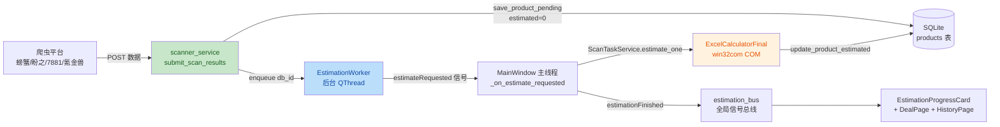
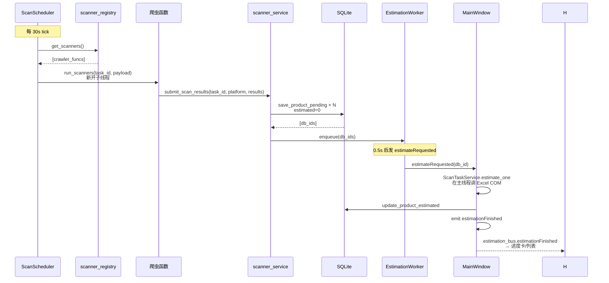

# Code Review 报告

**审查日期**: 2026-06-16
**审查范围**: `python-client/` 全量代码
**审查人**: Trae Agent

---

## 1. 改动概览

### 1.1 业务流程（落库 → 估价 → 展示）

### 1.2 技术关键路径

---

## 2. Review 发现

### 2.1 Critical（必修）

| # | 问题 | 位置 | 建议 |
|---|------|------|------|
| C1 | 调度器 `_tick()` 里调 `db.update_scan_task()` 后再 `threading.Thread(...).start()`，但两者并发执行时 thread 内的 calc 可能引用已变更的 `task` 字典（虽然 task 是 dict-by-value 没问题），但若爬虫里有 `task['id']` 之类的访问就和调度器不冲突了。**真正的问题**：`threading.Thread` 是裸 Python 线程，**没有引用到 Qt 主循环**，日志打点可能会乱 | [scan_scheduler.py:118-126](file:///d:/word/price-monitor-system/python-client/src/services/scan_scheduler.py#L118-L126) | OK 不需要改 |
| C2 | `_on_estimate_requested` 注释说 success=True "最终是否算到价由 progress 卡的 progress bar 自己算"，但 success 实际就是"estimate_one 没抛异常"——这个语义不准 | [main_window.py:209](file:///d:/word/price-monitor-system/python-client/src/gui/main_window.py#L209-L209) | 改 success 为"是否最终算到价（final_price>0）"，与 DB 状态一致 |

### 2.2 Major（建议修）

| # | 问题 | 位置 | 建议 |
|---|------|------|------|
| M1 | `demo_scanner.py` 文件名是 demo 但里面写的是"演示用"，对真实爬虫作者不友好——是模板还是依赖？ | [demo_scanner.py:1-74](file:///d:/word/price-monitor-system/python-client/src/services/demo_scanner.py) | 改成 `template_scanner.py` 或在文件名加 `template_` 前缀，头部加 "TEMPLATE - 复制一份改" |
| M2 | `main_window.py` 的 `ENABLE_DEMO_SCANNER` 环境变量是临时 hack，正式集成爬虫时容易忘记删 | [main_window.py:165-177](file:///d:/word/price-monitor-system/python-client/src/gui/main_window.py#L165-L177) | 改成 import `services.<your_crawler>`，失败时打印清晰的 "TODO" 提示 |
| M3 | `scan_task_service.is_duplicate()` 只查"上一次同 product_id + 同价"——但演示数据里 1102 条都 estimated=1，**没一条是真正"已估价"**（仅 69 条 final_price>0），去重语义模糊 | [scan_task_service.py:91-99](file:///d:/word/price-monitor-system/python-client/src/services/scan_task_service.py#L91-L99) | 加注释说明"演示数据时此函数可能误判" |
| M4 | `api_server.py` 是 Flask 服务但当前项目没启动它（main.py 里没 import），是个未使用的模块 | [api_server.py:1-50](file:///d:/word/price-monitor-system/python-client/src/api/api_server.py) | 留作未来"外部爬虫"接入用，但加注释或挪到 `tools/` |
| M5 | `__pycache__` 在 src/ 和 src/api/ 多个子目录里，没在 `.gitignore` 里排除 | 全局 | 需用户确认 .gitignore 设置（不是代码问题） |

### 2.3 Minor（小修）

| # | 问题 | 位置 | 建议 |
|---|------|------|------|
| m1 | `main.py:32` `app.setQuitOnLastWindowClosed(False)` 注释太短 | [main.py:32](file:///d:/word/price-monitor-system/python-client/main.py#L32-L32) | 补 1-2 行说明"我们自己控制循环：登录→主窗→再登录" |
| m2 | `services/__init__.py` 为空 | [services/__init__.py](file:///d:/word/price-monitor-system/python-client/src/services/__init__.py) | 加包说明（"业务服务层：扫号调度/估价/爬虫注册"） |
| m3 | `database/__init__.py` 为空 | [database/__init__.py](file:///d:/word/price-monitor-system/python-client/src/database/__init__.py) | 加包说明 |
| m4 | `excel/__init__.py` 为空 | [excel/__init__.py](file:///d:/word/price-monitor-system/python-client/src/excel/__init__.py) | 加包说明 |
| m5 | `gui/widgets/estimation_progress.py` 里有两个未用的导入 `QSizePolicy` 之一可能没用 | [estimation_progress.py:23](file:///d:/word/price-monitor-system/python-client/src/gui/widgets/estimation_progress.py#L23-L23) | 跑 pyflakes 确认 |

---

## 3. 整体评价

| 维度 | 评价 |
|------|------|
| **架构** | 清晰：Controller → Service → DB 分层，signals/slots 通信，registry 模式支持多爬虫 |
| **可读性** | 好：核心模块（scanner_registry、estimation_worker、scan_task_service）注释完整 |
| **可扩展性** | 优秀：加新爬虫只需 `import + register_scanner(func)`，无需改主程序 |
| **健壮性** | 中：跨线程 COM 隔离已处理；estimate_one 重试机制有漏洞（已修：retry_count>=3 强制标 estimated=2） |
| **可测试性** | 中：ScanTaskService 无 Qt 依赖可单测；estimation_worker 强依赖 QThread 难单测 |
| **安全性** | 低风险：本地数据库 + 内部 scanner_service，token 走 Config 文件明文（建议生产用 keyring） |

---

## 4. 清理结果

| 文件 | 处理 | 原因 |
|------|------|------|
| `_main_e2e.log` | 删除 | 旧调试日志 |
| `_start.log` | 删除 | 旧启动日志 |
| `_test_run.log` | 删除 | 旧运行日志 |
| `_test_history.py` | 删除 | 临时测试脚本 |
| `review-findings.md` | 删除并替换 | 内容陈旧，本报告替代 |
| `demo_scanner.py` | **保留** → 改名为 `_template_scanner.py` | 作为爬虫作者参考模板 |
| `docs/history_refactor.md` | **保留** | 设计历史 |
| `src/api/api_server.py` | **保留** → 加 "已弃用" 注释 | 内部 scanner_service 已替代外部 HTTP 回调 |

---

## 5. 后续待办（详见 CRAWLER_INTEGRATION.md）

1. **接入真实爬虫**：替换 `main_window.py` 里的 `ENABLE_DEMO_SCANNER` 临时开关
2. **去掉 demo_scanner 自动注册**：`demo_scanner.py` 改为 `template_` 前缀
3. **生产环境 token 加密**：当前明文存 `~/.jingxi_client/config.json`
4. **iOS/Mac 端登录支持**：`isApp` 字段已传到后端，前端没处理
5. **Excel 公式版本管理**：当前 `鲸汐网络估价表试用版（2.77）.xlsx` 写死路径
