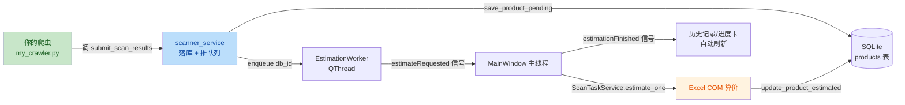

# 爬虫集成指南（2 分钟看完）

> **TL;DR**：你只需要写一个 `my_crawler(task_id, payload)` 函数，里面调 `submit_scan_results(...)` 落库，然后 `import` 一下就完事。

---

## 1. 项目数据怎么流（一眼看懂）



**你只需要管 A，其它都自动**：
- 落库（B）→ 自动
- 估价（D → E → F）→ 自动
- UI 刷新（G）→ 自动

---

## 2. 你要改哪 3 个地方

```
python-client/
├── src/
│   ├── services/
│   │   ├── crawler_<平台>.py      ← ① 新建：你的爬虫（复制 demo_scanner 改）
│   │   ├── scanner_service.py     ← ② 不用改：调它的 submit_scan_results
│   │   └── scanner_registry.py    ← ③ 不用改：在你的 py 底部 register_scanner()
│   └── gui/
│       └── main_window.py         ← ④ 加一行 import 你的爬虫
```

| # | 文件 | 操作 | 难度 |
|---|------|------|------|
| ① | `src/services/crawler_<平台>.py` | **新建**，复制 `demo_scanner.py` 改 | ⭐ |
| ② | `main_window.py` 第 ~170 行 | 加一行 `import services.crawler_<平台>` | ⭐ |
| ③ | `demo_scanner.py` | 接入成功后**删掉**（或保留作 demo） | ⭐ |

---

## 3. 3 步接入

### Step 1：复制模板

```bash
cd src/services
cp demo_scanner.py crawler_pangxie.py    # 例：螃蟹平台
```

### Step 2：只改这个函数

打开 `crawler_pangxie.py`，把 `demo_crawler()` 改名 + 改里面**标记的那一行**：

```python
def my_crawler(task_id: int, payload: dict) -> None:
    """你的爬虫：爬螃蟹平台的所有任务数据"""
    platforms = payload.get("platforms") or ["螃蟹"]
    games     = payload.get("games") or ["火影忍者"]
    scan_limit= payload.get("scan_limit", 50) or 50

    for platform in platforms:
        for game in games:
            # ★★★ 改这一段 ★★★
            # 原来：results = [_make_random_item(...) for i in range(N)]
            # 现在：results = requests.get(...).json()  # 你自己的爬虫逻辑
            results = scrape_pangxie(platform, game, scan_limit)  # 你写的函数

            # ★ 这一段不要改（落库） ★
            submit_scan_results(task_id=task_id, platform=platform, results=results)


# ★ 这一行不要改（自动注册） ★
register_scanner(my_crawler)
```

**`results` 每条 dict 字段**（必填 `product_id` + `original_price`，其它可选）：

```python
{
    "product_id":        "平台给的外ID",   # ← 去重 key，必填
    "original_price":    100.0,            # ← 卖家挂价，必填
    "product_info":      "商品描述",       # ← 给 Excel 公式解析用
    "url":               "https://...",    # ← UI 复制按钮
    "game_type":         "火影忍者",       # ← 必须匹配 Excel 工作表里的游戏名
    "supports_realname": True,             # ← 影响议价公式
}
```

### Step 3：在 main_window.py 加一行

打开 `src/gui/main_window.py`，找到这一段（约 165 行）：

```python
# 3.5) 导入爬虫（让 register_scanner 自动生效）
# ============================================================
# ★★★ 爬虫集成点 ★★★
# 真实生产：把下面的 `services.demo_scanner` 替换成你的真实爬虫模块
# ============================================================
try:
    import services.demo_scanner  # TODO[爬虫集成]: 替换为真实爬虫模块路径
    print("[MainWindow] demo_scanner 已注册（演示模式）")
except Exception as e:
    print(f"[MainWindow] 爬虫模块导入失败: {e}（扫号任务将无爬虫可调度）")
```

**改成**：

```python
try:
    import services.demo_scanner       # 演示数据，可选保留
    import services.crawler_pangxie    # ← 加这一行
    import services.crawler_panzhi     # ← 一行一平台
    print("[MainWindow] 爬虫已注册")
except Exception as e:
    print(f"[MainWindow] 爬虫模块导入失败: {e}")
```

**重启 app**。日志里应该看到 `[scanner_registry] 注册爬虫: my_crawler`。

---

## 4. 怎么测你的爬虫

### 4.1 命令行测（不打开 app）

```python
# test_crawler.py
import sys; sys.path.insert(0, r'D:\word\price-monitor-system\python-client\src')
from services.crawler_pangxie import my_crawler

my_crawler(task_id=1, payload={
    "platforms":  ["螃蟹"],
    "games":      ["火影忍者"],
    "scan_mode":  "latest",
    "scan_limit": 5,
})
```

### 4.2 app 里测

新建一个扫号任务（点"扫号任务"页 → 新建），勾选螃蟹 + 火影，点保存。
等 30s（调度器 tick），看"历史记录"页是否出现新商品 + 进度卡是否有动作。

### 4.3 看日志确认

```
[ScanScheduler] 触发扫号 task_id=1 mode=latest
[scanner_registry] 注册爬虫: my_crawler
[scanner_service] task_id=1 platform=螃蟹 入队 25/25 条
[EstimationWorker] emit estimateRequested(1234)
[MainWindow] 估价 product#1234 成功/失败
```

---

## 5. 常见问题

| 现象 | 原因 | 修法 |
|------|------|------|
| 启动日志没"注册爬虫: my_crawler" | `import` 没生效 / 函数没在 py 底部调 `register_scanner` | 查 import 路径和 py 底部 |
| 商品落库了但估价全 0 | `product_info` 格式 Excel 解析不了 / `game_type` 拼错 | 看 `excel_calculator_final.py` 里 `收价文本` sheet 的公式期望 |
| 同一商品重复入库 | `product_id` 没归一化（大小写/空格） | 爬虫里 `pid = pid.strip().lower()` |
| 进度卡一直 0 | 调度器没触发（任务 enabled=0 / 时间窗口不对） | 看 `[ScanScheduler] 触发扫号 task_id=1` 日志 |
| UI 卡死 | 1 个产品估价耗 30s+ | Excel 公式太重，加缓存或简化 |

---

## 6. 文件清单（不需改的，看一眼即可）

| 文件 | 作用 |
|------|------|
| `services/scanner_registry.py` | 爬虫函数注册中心，**不要改** |
| `services/scanner_service.py` | 落库入口（`submit_scan_results`），**不要改** |
| `services/scan_scheduler.py` | 30s tick 调度器，**不要改** |
| `services/estimation_worker.py` | 估价 Worker，**不要改** |
| `services/scan_task_service.py` | 单产品估价流程，**不要改** |
| `excel/excel_calculator_final.py` | Excel COM 算价，**不要改**（除非你懂 COM） |
| `database/db_manager_v2.py` | SQLite 封装，**不要改** |

---

## 7. 进阶（接入完成后可看）

- **多平台协作**：在 `crawler_pangxie.py` 里同时调 `submit_scan_results(platform="螃蟹", ...)` 和 `submit_scan_results(platform="盼之", ...)`
- **限速**：在爬虫里 `time.sleep(0.5)` 别把平台搞挂
- **重试**：用 `tenacity` 包你的 HTTP 调用
- **cookie/登录态**：用 `requests.Session()`，登录态单独模块管理
- **异步**：超过 1000 条/次建议用 `aiohttp`，但落库接口不变
